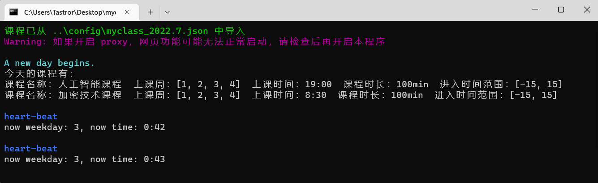

# help-my-class-please

网课自动登录


### 简介

腾讯会议、腾讯课堂的自动化登录的 python 程序．


### 演示




### 环境与平台

由于使用了大量快捷键和屏幕识别，目前仅支持 windows7 及以上的平台．


### 使用方式

- 进入`client`目录．

  ```shell
  cd client
  ```

- 安装依赖项（建议使用虚拟环境，否则很容易在更新后产生版本冲突），以 conda 为例．

  ```shell
  conda create -n class_env python=3.9
  conda activate class_env
  pip install -r requirements.txt  # conda install --file requirements.txt
  ```

- 进入 `config` 目录．

  ```shell
  cd ..\config
  ```
  
- 仿照样例配置好 class.json．

  ```
  [
  {
      "腾讯会议": "C:/Program Files (x86)/Tencent/WeMeet/wemeetapp.exe",     // 你的安装路径
      "腾讯课堂": "C:/Program Files (x86)/Tencent/EDU/bin/TXEDU.exe"
  },
  [
      {
          "name": "泡面的艺术",                // 课程名称
          "platform": "腾讯会议",              // 平台（目前支持腾讯会议和腾讯课堂）
          "detail": {                         // 详细信息，包括网址、会议号、会议密码、入会名称
              "url": "",
              "id": "123-4567-8901",
              "passwd": "12345",
              "myname": "3141592653-张三",
              "auto_close_audio": true        // 自动静音，默认为 true
          },
          "weekday": [1, 3, 5],               // 上课的星期
          "time": "8:30",                     // 课程开始时间
          "time_range": [-5, 15],             // 允许登录的时间范围
                                              //（提前5分钟或者推迟15分钟的范围内，如果还没登录就会登录）
          "time_lasting": 100                 // 课程时长
      },
      {
          "name": "睡大觉",
          "platform": "腾讯课堂",
          "detail": {
              "using": "url",                 // 课堂登录方式（目前还仅支持 url 网页登录）
              "url": "https://ke.qq.com/webcourse/1234567/123456789#taid=12345678901234567&lite=1"
          },
          "weekday": [1, 2, 3, 4, 5, 6, 7],
          "time": "10:30",
          "time_range": [-99999, 99999],
          "time_lasting": 30
      }
  ]
  ]
  ```

- 尝试运行 `helpMyClassPlease.py`．

  ```shell
  python ..\client\helpMyClassPlease.py
  ```
  
  即可运行．如果要一直运行，需要后台常开且不能进入睡眠模式．
  
  如果要自行使用参数（如重新指定 class.json 路径、启动测试时间），可以使用
  
  ```shell
  python ..\client\helpMyClassPlease.py -j "..\..\myclass.json"
                               # or use: --json "..\..\myclass.json"
  python ..\client\helpMyClassPlease.py -t "[10, 2, 499]"
                               # or use: --test "[10, 2, 499]"
  ```
  
  其中测试时间的三个值分别为：每分钟的秒数、当前星期、当前距离 0:00 的分钟数．
  
  这两个参数可以同时添加．
  
  尝试运行成功后退出，回到原来的 config 文件夹．
  
- 用编辑器打开 `class-shortcut.bat`，照着注释修改．

  ```shell
  @echo off
  
  rem : this is your disk name where client directory is in
  F:
  
  rem : [YOUR-PATH] is your path to client directory
  cd "\[YOUR-PATH]\help-my-class-please\client"
  
  rem : [class] is your python environment
  call conda activate [class]
  
  rem : [myclass.json] is your class.json
  python .\helpMyClassPlease.py -j "..\config\[myclass.json]"
  ```

- 之后，只需双击运行 `class-shortcut.bat` 即可．


### 其他

class.json 给了一份测试文件，任何时候都会触发登录，可以先看看能不能跑．

目前代码还很简单，大家可以根据需求自行修改．

img 文件夹提供了图标，可以创建快捷方式使用．

腾讯课堂目前只能采用网页版本（因为客户端识别还没整完），之后会支持客户端的．

待办

- [x] 提供自选命令行参数
- [x] 架构重构
- [x] 自动静音
- [ ] 客户端和网页版自主选择
- [x] 腾讯课堂自动签到
- [ ] 其他网课软件的支持
